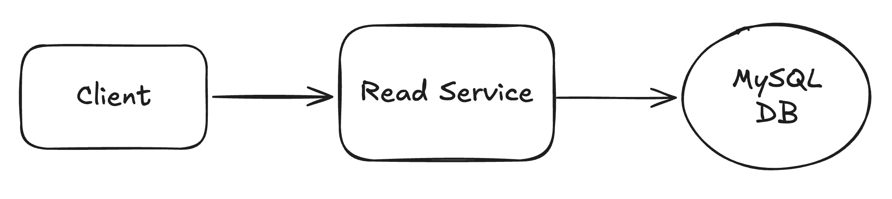

# 📺 Url Shortener – Section 2

Welcome! This section walks you through setting up the **Read Service** of the URL Shortener project — including building the Lambda function, testing it locally, packaging it for deployment, and sending a test event through AWS.

<div align="center">
    
</div>

## 🎥 Video Walkthrough

**Title:** Url Shortener – Section 2  
**Link:** [Watch on Udemy](https://www.udemy.com)

# ⚙️ Instructions and Commands

### 1. Create the Project Directory

Create the base project folder:

```bash
mkdir -p ~/Desktop/url-shortener-demo
```

Open the folder in VS Code:

```bash
code -r ~/Desktop/url-shortener-demo
```

&nbsp;&nbsp;&nbsp;&nbsp; _Alternatively, you can also drag the `url-shortener-demo` folder directly into VS Code._

### 2. Create and Activate Python Virtual Environment

Create a new virtual environment:

```bash
python3 -m venv url-shortener-venv
```

- Alternatively (on some systems):

  ```bash
  python -m venv url-shortener-venv
  ```

Activate the environment:

```bash
source url-shortener-venv/bin/activate
```

-  On **Windows PowerShell**:

  ```bash
  .\url-shortener-venv\Scripts\Activate.ps1
  ```

- 💬 **Note**: If activation fails, you may need to allow script execution first:
  ```bash
  Set-ExecutionPolicy -Scope CurrentUser -ExecutionPolicy RemoteSigned -Force
  ```

### 3. Create Read Service Package Structure

Create the read service folder:

```bash
mkdir read_lambda_package
```

Create the Lambda function file:

```bash
touch read_lambda_package/lambda_function.py
```

-  On **Windows PowerShell**:
  ```bash
  New-Item read_lambda_package/lambda_function.py -ItemType File
  ```

### 4. Install Packages and Test Locally

Install pymysql:

```bash
pip install pymysql
```

- Alternatively (on some systems):

  ```bash
  pip3 install pymysql
  ```

Run the Lambda function locally with sample short key `abc123`:

```bash
python read_lambda_package/lambda_function.py
```

Run it again using the sample short key `xyz321`:

```bash
python read_lambda_package/lambda_function.py
```

### 5. Package Read Service and Dependencies for Upload

Navigate into the package directory:

```bash
cd read_lambda_package
```

Install `pymysql` into the local folder (for Lambda packaging):

```bash
pip install pymysql -t .
```

- Alternatively (on some systems):
  ```bash
  pip3 install pymysql -t .
  ```

Create a deployment package:

```bash
zip -r lambda_function.zip .
```

-  On **Windows PowerShell**:
  ```bash
  Compress-Archive -Path * -DestinationPath lambda_function.zip
  ```

### 6. Send Test Events in AWS Lambda Console

Run the function using the default sample test event:

```bash
{
  "key1": "value1",
  "key2": "value2",
  "key3": "value3"

}
```

Test with a properly formatted event using the short key `abc123`:

```bash
{
  "pathParameters": {
      "shortKey": "abc123"
  }
}
```

Test with a properly formatted event using a short key that does not exist in the database:

```bash
{
  "pathParameters": {
      "shortKey": "doesNotExist"
  }
}
```

<br>
