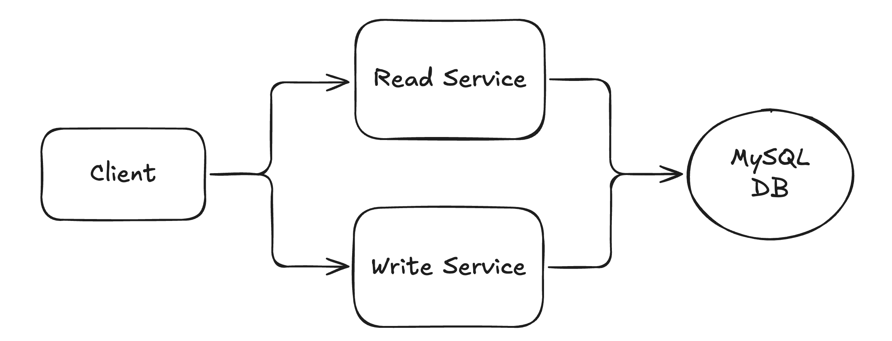

# 📺 Url Shortener – Section 3

Welcome! This section walks you through setting up the initial **Write Service** of the URL Shortener project — including building the Lambda function, testing it locally, packaging it for deployment, and sending a test event through AWS.

<div align="center">
    
</div>

## 🎥 Video Walkthrough

**Title:** Url Shortener – Section 3  
**Link:** [Watch on Udemy](https://www.udemy.com)

# ⚙️ Instructions and Commands

### 1. Activate Virtual Environment

```bash
source url-shortener-venv/bin/activate
```

-  On **Windows PowerShell**:
  ```bash
  .\url-shortener-venv\Scripts\Activate.ps1
  ```

### 2. Create Write Service Package Structure

Create the write service folder:

```bash
mkdir write_lambda_package
```

Create the Lambda function file:

```bash
touch write_lambda_package/lambda_function.py
```

-  On **Windows PowerShell**:
  ```bash
  New-Item write_lambda_package/lambda_function.py -ItemType File
  ```

### 3. Test Write Service Locally

Run the Lambda function locally to create a custom alias `custom` that maps to long URL `https://excalidraw.com/`:

```bash
python write_lambda_package/lambda_function.py
```

Run it again to create an auto-generated short key for `https://excalidraw.com/`:

```bash
python write_lambda_package/lambda_function.py
```

### 4. Connect to MySQL Instance Remotely

Launch a MySQL container:

```bash
docker run -it --rm mysql:latest bash
```

Connect to your RDS MySQL database:

```bash
mysql -h <PASTE_YOUR_RDS_ENDPOINT_HERE> -u admin -p
```

> _When prompted, enter the database password:_ `Password100!`

Switch to the `urls_db` database:

```bash
USE urls_db;
```

### 5. Verify Database Writes

Inside the MySQL Docker container, query the `Urls` table to confirm the records were created:

```bash
SELECT * FROM Urls;
```

### 6. Package Write Service and Dependencies for Upload

Navigate into the package directory:

```bash
cd write_lambda_package
```

Install `pymysql` into the local folder (for Lambda packaging):

```bash
pip install pymysql -t .
```

- Alternatively (on some systems):
  ```bash
  pip3 install pymysql -t .
  ```

Create a deployment package:

```bash
zip -r lambda_function.zip .
```

-  On **Windows PowerShell**:
  ```bash
  Compress-Archive -Path * -DestinationPath lambda_function.zip
  ```

### 7. Send Test Events in AWS Lambda Console

Run the function using the default sample test event:

```bash
{
  "key1": "value1",
  "key2": "value2",
  "key3": "value3"

}
```

Test with a properly formatted event to create an auto-generated short key for `https://excalidraw.com/`:

```bash
{
  "body": "{\"longUrl\": \"https://excalidraw.com/\"}"
}
```

Test with a properly formatted event using the custom alias `custom`, which already exists in the database:

```bash
{
  "body": "{\"longUrl\": \"https://excalidraw.com/\", \"shortKey\": \"custom\"}"
}
```

<br>
