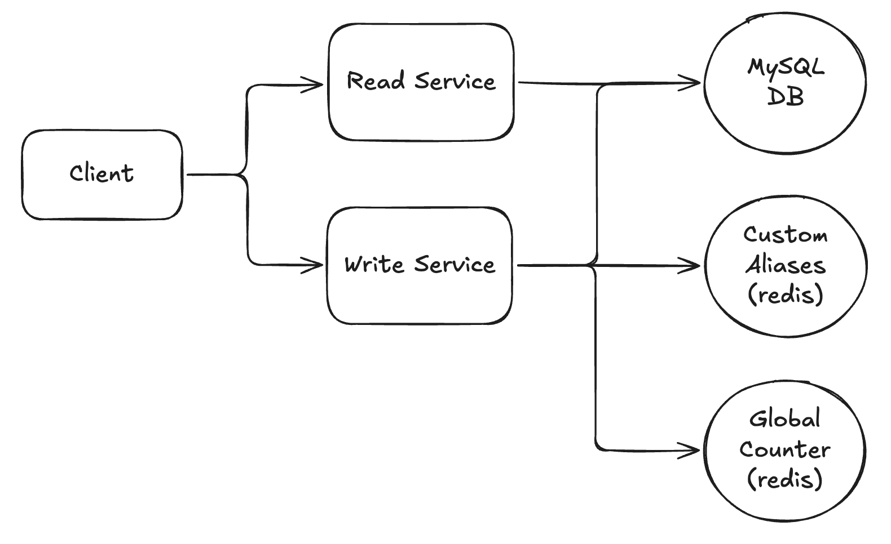

# 📺 Url Shortener – Section 4

In this section, we enhance the **Write Service** by using **Redis** for smarter short key generation and enforcing custom alias uniqueness. We’ll integrate the **Sqids** library with a Redis-backed counter to generate compact, URL-safe short keys — and use a Redis set to efficiently track and validate user-defined aliases. You'll also learn how to update and re-deploy your Lambda function with this new logic, and test the improvements directly from the AWS console.

<div align="center">
    
</div>

## 🎥 Video Walkthrough

**Title:** Url Shortener – Section 4  
**Link:** [Watch on Udemy](https://www.udemy.com/course/practical-system-design/learn/lecture/55998265#overview)

# ⚙️ Instructions and Commands

### 1. Prepare `redis-cli`

For **macOS** users, install `redis-cli` locally using Homebrew:

```bash
brew install redis
```

> For **Windows** users, we’ll use `redis-cli` via Docker, so no additional installation is required.

### 2. Connect to Redis Instance Using CLI

Connect to your Redis instance using the CLI:

```bash
redis-cli -u redis://default:<YOUR_PASSWORD>@<YOUR_HOST>:<YOUR_PORT>
```

-  On **Windows PowerShell**:
  ```bash
  docker run -it --rm redis redis-cli -u redis://default:<YOUR_PASSWORD>@<YOUR_HOST>:<YOUR_PORT>
  ```

Verify that Redis is currently in its empty initial state:

```bash
keys *
```

### 3. Initialize the `custom_aliases` Set in Redis

From the Redis CLI, add a placeholder value to initialize the `custom_aliases` set:

```bash
sadd url_shortener:custom_aliases ___temp___
```

Verify set was created:

```bash
keys *
```

Inspect the contents of the set:

```bash
smembers url_shortener:custom_aliases
```

### 4. Initialize the Global Counter in Redis

From the Redis CLI, create a global counter to keep track of the number of short links generated:

```bash
set url_shortener:counter 0
```

Verify the counter key was created:

```bash
keys *
```

Retrieve the current value of the counter:

```bash
get url_shortener:counter
```

### 5. Activate Python Virtual Environment and Install Redis

Activate the `url-shortener-venv` environment:

```bash
source url-shortener-venv/bin/activate
```

-  On **Windows PowerShell**:
  ```bash
  .\url-shortener-venv\Scripts\Activate.ps1
  ```

Install `redis` into your virtual environment:

```bash
pip install redis
```

- Alternatively (on some systems):

  ```bash
  pip3 install redis
  ```

### 6. Connect to MySQL Instance Remotely

Launch a MySQL container:

```bash
docker run -it --rm mysql:latest bash
```

Connect to your RDS MySQL database:

```bash
mysql -h <PASTE_YOUR_RDS_ENDPOINT_HERE> -u admin -p
```

> _When prompted, enter the database password:_ `Password100!`

Switch to the `urls_db` database:

```bash
USE urls_db;
```

### 7. Reset `Urls` Table

Inside the MySQL Docker container, view existing records in the `Urls` table:

```bash
SELECT * FROM Urls;
```

Clear all records from the `Urls` table:

```bash
DELETE FROM Urls;
```

> 💬 Note: This resets the table so we can test with a clean slate during the upcoming refactor demo.

### 8. Test Custom Alias Flow Locally

Run the Lambda function locally to create a custom alias `abc123` that maps to long URL `https://google.com/`:

```bash
python write_lambda_package/lambda_function.py
```

Run it again to create a custom alias `xyz321` that maps to long URL `https://wikipedia.com/`:

```bash
python write_lambda_package/lambda_function.py
```

Inside the MySQL Docker container, view the existing records in the `Urls` table:

```bash
SELECT * FROM Urls;
```

Inside Redis CLI, list the current members of the custom aliases set:

```bash
smembers url_shortener:custom_aliases
```

Run the Lambda function locally using the duplicate custom alias `xyz321`:

```bash
python write_lambda_package/lambda_function.py
```

### 9. Install Sqids Pacakge into Virtual Environment

```bash
pip install sqids
```

- Alternatively (on some systems):

  ```bash
  pip3 install sqids
  ```

### 10. Test Auto-Generation Flow Locally

Inside Redis CLI, check the current counter value:

```bash
get url_shortener:counter
```

Run the Lambda function locally to create an auto-generated short key for `https://excalidraw.com/`:

```bash
python write_lambda_package/lambda_function.py
```

Inside Redis CLI, verify that the counter value has incremented:

```bash
get url_shortener:counter
```

Inside the MySQL Docker container, view the updated records in the `Urls` table:

```bash
SELECT * FROM Urls;
```

### 11. Package Write Service and Dependencies for Upload

Navigate into the package directory:

```bash
cd write_lambda_package
```

List out contents of the directory:

```bash
ls
```

Delete previous zip file:

```bash
rm lambda_function.zip
```

Install `redis` and `sqids` into the local folder (for Lambda packaging):

```bash
pip install redis sqids -t .
```

- Alternatively (on some systems):
  ```bash
  pip3 install redis sqids -t .
  ```

Create a deployment package:

```bash
zip -r lambda_function.zip .
```

-  On **Windows PowerShell**:
  ```bash
  Compress-Archive -Path * -DestinationPath lambda_function.zip
  ```

### 12. Send Test Events in AWS Lambda Console

Test with a properly formatted event to create the custom alias `custom` for `https://amazon.com/`:

```bash
{
  "body": "{\"longUrl\": \"https://amazon.com/\", \"shortKey\": \"custom\"}"
}
```

Test with a properly formatted event to create an auto-generated short key for `https://amazon.com/`:

```bash
{
  "body": "{\"longUrl\": \"https://amazon.com/\"}"
}
```

<br>
