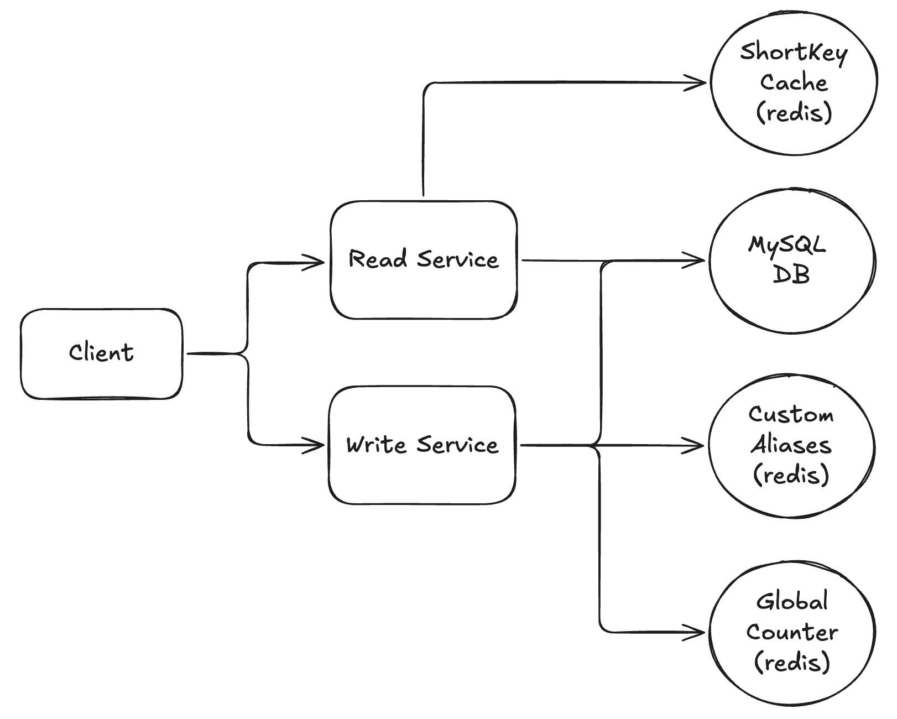

# 📺 Url Shortener – Section 5

In this section, we refactor the **Read Service** to improve performance using **Redis as a cache**. The updated Lambda function will check Redis for a short key match before querying the database — reducing latency and database load.

<div align="center">
    
</div>

## 🎥 Video Walkthrough

**Title:** Url Shortener – Section 5  
**Link:** [Watch on Udemy](https://www.udemy.com/course/practical-system-design/learn/lecture/55998267#overview)

# ⚙️ Instructions and Commands

### 1. Connect to Redis Instance Using CLI

Connect to your Redis instance using the CLI:

```bash
redis-cli -u redis://default:<YOUR_PASSWORD>@<YOUR_HOST>:<YOUR_PORT>
```

-  On **Windows PowerShell**:
  ```bash
  docker run -it --rm redis redis-cli -u redis://default:<YOUR_PASSWORD>@<YOUR_HOST>:<YOUR_PORT>
  ```

View current keys in Redis:

```bash
keys *
```

### 2. Initialize the `shortKey_cache` Hash Set in Redis

Add a placeholder value to initialize the `shortKey_cache` hash set:

```bash
hset url_shortener:shortKey_cache ___temp___ ""
```

Verify hash set was created

```bash
keys *
```

Inspect the keys of the hash set:

```bash
hkeys url_shortener:shortKey_cache
```

Grab the value associated with the `__temp__` key:

```bash
hget url_shortener:shortKey_cache __temp__
```

### 3. Connect to MySQL Instance

Launch a MySQL container:

```bash
docker run -it --rm mysql:latest bash
```

Connect to your RDS MySQL database:

```bash
mysql -h <PASTE_YOUR_RDS_ENDPOINT_HERE> -u admin -p
```

> _When prompted, enter the database password:_ `Password100!`

Switch to the `urls_db` database:

```bash
USE urls_db;
```

### 4. Review Current Database State

Inside the MySQL Docker container, query the `Urls` table to view the existing records:

```bash
SELECT * FROM Urls;
```

### 5. Test Read Service Locally

> _Please make sure your virtual environment is activated. You can revisit **[Section 3 → Step 1](/section_03/README.md#1-activate-virtual-environment)** for the exact command._

Run the Lambda function locally using the short key `abc123`:

```bash
python read_lambda_package/lambda_function.py
```

Run it again with the same short key `abc123` to observe a cache hit:

```bash
python read_lambda_package/lambda_function.py
```

### 6. Verify Redis Behavior

Inside Redis CLI, list the keys currently stored in the `shortKey_cache`:

```bash
hkeys url_shortener:shortKey_cache
```

Inspect the cached mapping for the key `abc123`:

```bash
hget url_shortener:shortKey_cache abc123
```

### 7. Package Read Service and Dependencies for Upload

Navigate into the package directory:

```bash
cd read_lambda_package
```

Delete previous zip file:

```bash
rm lambda_function.zip
```

Install `redis` into the local folder (for Lambda packaging):

```bash
pip install redis -t .
```

- Alternatively (on some systems):
  ```bash
  pip3 install redis -t .
  ```

Create a deployment package:

```bash
zip -r lambda_function.zip .
```

-  On **Windows PowerShell**:
  ```bash
  Compress-Archive -Path * -DestinationPath lambda_function.zip
  ```

### 8. Send Test Events in AWS Lambda Console

Test with a properly formatted event using the short key `xyz321`:

```bash
{
  "pathParameters": {
      "shortKey": "xyz321"
  }
}
```

Run the same event again with the short key `xyz321` to observe a cache hit:

```bash
{
  "pathParameters": {
      "shortKey": "xyz321"
  }
}
```

<br>
