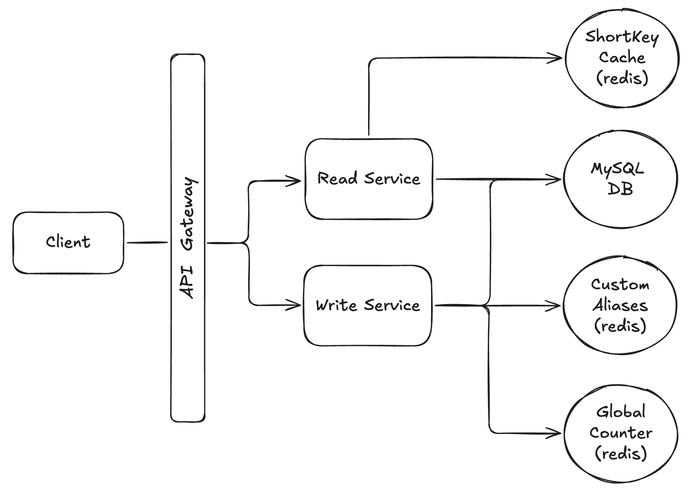

# 📺 Url Shortener – Section 6

In this section, we introduce **API Gateway** to serve as the public entry point for our URL Shortener. You'll configure it to route:

- **GET** requests to the **Read Lambda**
- **POST** requests to the **Write Lambda**

<div align="center">
    
</div>

## 🎥 Video Walkthrough

**Title:** Url Shortener – Section 6  
**Link:** [Watch on Udemy](https://www.udemy.com/course/practical-system-design/learn/lecture/55998271#overview)

# ⚙️ Instructions and Commands

### 1. Test the Read (`GET`) Endpoint

Send a test request to retrieve the long URL for short key `abc123`:

```bash
curl -i -X GET "<PASTE_YOUR_API_GATEWAY_INVOKE_URL>/url/abc123"
```

-  On **Windows PowerShell**:
  ```bash
  curl.exe -i -X GET "<PASTE_YOUR_API_GATEWAY_INVOKE_URL>/url/abc123"
  ```

### 2. Test the Write (`POST`) Endpoint

Send a request to create an auto-generated short key that maps to `https://www.facebook.com`:

```bash
curl -i -X POST "<PASTE_YOUR_API_GATEWAY_INVOKE_URL>/url" \
  -H "Content-Type: application/json" \
  -d '{
    "longUrl": "https://www.facebook.com"
  }'
```

-  On **Windows PowerShell**:
  ```bash
  curl.exe -i -X POST "<PASTE_YOUR_API_GATEWAY_INVOKE_URL>/url" `
    -H "Content-Type: application/json" `
    -d '{\"longUrl\": \"https://www.facebook.com\"}'
  ```

### 3. Test Redirect Behavior in the Browser

Paste the following URLs into your browser to confirm they redirect to the correct destination:

```bash
<PASTE_YOUR_API_GATEWAY_INVOKE_URL>/url/abc123
```

```bash
<PASTE_YOUR_API_GATEWAY_INVOKE_URL>/url/xyz321
```

<br>
