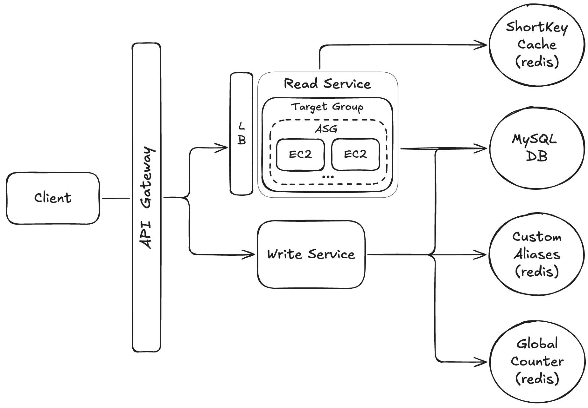

# 📺 Url Shortener – Section 7

In this section, we take our **Read Service** from local development all the way to a scalable cloud deployment.

- **Part 1** focuses on building the Read Flask app, containerizing it with Docker, and launching a single EC2 instance to manually host the service.
- **Part 2** introduces production-grade infrastructure. We create a **Launch Template**, **Target Group**, **Application Load Balancer (ALB)**, and **Auto Scaling Group (ASG)** to automatically scale and route traffic to healthy instances of our Read Service.

<div align="center">
    
</div>

## 🎥 Video Walkthroughs

### 🔹 Part 1: Read Flask App Setup, Dockerization, and EC2 Deployment

**Title:** Url Shortener – Section 7 (Part 1)  
**Link:** [Watch on Udemy](https://www.udemy.com/course/practical-system-design/learn/lecture/55998273#overview)

### 🔹 Part 2: Launch Template, Autoscaling, Load Balancing

**Title:** Url Shortener – Section 7 (Part 2)  
**Link:** [Watch on Udemy](https://www.udemy.com/course/practical-system-design/learn/lecture/55998275#overview)

# ⚙️ Instructions and Commands

## ✏️ Part 1 – Read Flask App Setup, Dockerization, and EC2 Deployment

### 1. Activate Python Virtual Environment

Activate the `url-shortener-venv` environment:

```bash
source url-shortener-venv/bin/activate
```

-  On **Windows PowerShell**:
  ```bash
  .\url-shortener-venv\Scripts\Activate.ps1
  ```

### 2. Set Up the Read Flask App

Create a directory for the Flask app:

```bash
mkdir read_flask_app
```

Create the `app.py` file inside the directory:

```bash
touch read_flask_app/app.py
```

-  On **Windows PowerShell**:
  ```bash
  New-Item read_flask_app/app.py -ItemType File
  ```

Create the `requirements.txt` file:

```bash
touch read_flask_app/requirements.txt
```

-  On **Windows PowerShell**:
  ```bash
  New-Item read_flask_app/requirements.txt -ItemType File
  ```

### 3. Install Dependencies

Install the required packages from `requirements.txt`:

```bash
pip install -r read_flask_app/requirements.txt
```

- Alternatively (on some systems):

  ```bash
  pip3 install -r read_flask_app/requirements.txt
  ```

### 4. Run Flask App & Test Locally

Start the Flask app:

```bash
python read_flask_app/app.py
```

Once the server is running, open the following URL in your browser to test the endpoint:

```bash
http://127.0.0.1:5000/url/xyz321
```

- If you run into network or firewall issues, try using your machine’s local IP address instead:
  ```bash
  http://<PASTE_YOUR_LOCAL_IP_ADDRESS>:5000/url/xyz321
  ```

Stop the Flask server:

```bash
Ctrl + C
```

### 5. Create Dockerfile for Read Flask App

Create a `Dockerfile` in the `read_flask_app` directory:

```bash
touch read_flask_app/Dockerfile
```

-  On **Windows PowerShell**:
  ```bash
  New-Item read_flask_app/Dockerfile -ItemType File
  ```

### 6. Build & Test Dockerized Read Flask App Locally

Navigate to the Flask app directory:

```bash
cd read_flask_app
```

Build the Docker image:

```bash
docker build -t test-url-shortener-read-flask-app .
```

Run the container and expose port `5000`:

```bash
docker run -p 5000:5000 test-url-shortener-read-flask-app
```

Once the container is running, open the following URL in your browser to test the endpoint:

```bash
http://127.0.0.1:5000/url/xyz321
```

- If you encounter network or firewall issues, try using `localhost` instead:
  ```bash
  http://localhost:5000/url/xyz321
  ```

### 7. Build & Push the Image for the Correct Architecture

Log out and log back into Docker:

```bash
docker logout && docker login
```

-  On **Windows PowerShell**:
  ```bash
  docker logout; docker login
  ```

> _When prompted, enter your Docker Hub username and password (or access token)._

Set up BuildKit and enable `buildx`:

```bash
docker buildx create --use
```

Build the image for the `linux/amd64` architecture and push it to Docker Hub:

```bash
docker buildx build --platform linux/amd64 -t <PASTE_YOUR_DOCKERHUB_USERNAME>/url-shortener-read --push .
```

### 8. Connect to EC2 Instance via SSH

If you are still inside the `read_flask_app` directory, return to the project root:

```bash
cd ..
```

If you're on **macOS** or **Linux**, update the key pair file permissions (**Windows** users can usually skip this step):

```bash
chmod 400 "url-shortener-key-pair.pem"
```

Use the provided command to connect to your EC2 instance:

```bash
ssh -i "url-shortener-key-pair.pem" ubuntu@<YOUR_PUBLIC_IPV4_DNS>
```

> _When prompted, type `yes` for fingerprint verification._

### 9. Run the Read Flask App on Your EC2 Instance

Once connected to your EC2 instance, run the following commands (these are the same commands used in `user-data.sh`, prefixed with `sudo`):

```sh
# Step 1: Update and install Docker
sudo apt-get update -y
sudo apt-get install -y docker.io

# Step 2: Enable and start Docker
sudo systemctl enable docker
sudo systemctl start docker

# Step 3: Pull and run your Docker image
sudo docker pull <PASTE_YOUR_DOCKERHUB_USERNAME>/url-shortener-read
sudo docker run -d -p 5000:5000 <PASTE_YOUR_DOCKERHUB_USERNAME>/url-shortener-read
```

### 10. Test in Web Browser

Open the following URL in your browser and confirm the expected redirect behavior:

```bash
http://<PASTE_YOUR_PUBLIC_IPV4_ADDRESS>:5000/url/xyz321
```

> 💡 _Replace `<PASTE_YOUR_PUBLIC_IPV4_ADDRESS>` with your EC2 instance’s public IPv4 address._  
> &nbsp;&nbsp;&nbsp;&nbsp; _Be sure to include both the `http://` prefix and `:5000` port number._

<br>

## ✏️ Part 2 – Launch Template, Autoscaling, Load Balancing

### 1. Configure Launch Template User Data

Paste the following script into the **User Data** section of your launch template (this is the same script included in `user-data.sh`):

> ⚠️ **Important**  
> &nbsp;&nbsp;&nbsp;&nbsp;&nbsp;&nbsp;&nbsp;_Replace `<PASTE_YOUR_DOCKERHUB_USERNAME>` with your own Docker Hub username._

```bash
#!/bin/bash

# Step 1: Update and install Docker
apt-get update -y
apt-get install -y docker.io

# Step 2: Enable and start Docker
systemctl enable docker
systemctl start docker

# Step 3: Pull and run your Docker image
docker pull <PASTE_YOUR_DOCKERHUB_USERNAME>/url-shortener-read
docker run -d -p 5000:5000 <PASTE_YOUR_DOCKERHUB_USERNAME>/url-shortener-read
```

### 2. Test the Setup via API Gateway

Open the following URL in your browser and confirm the expected redirect behavior:

```bash
<PASTE_YOUR_API_GATEWAY_INVOKE_URL>/url/xyz321
```

> ℹ️ _Your API Gateway Invoke URL should already include the `https://` prefix._

### 3. SSH into Both ASG-Managed EC2 Instances

Open two terminal windows — one for each EC2 instance launched by the Auto Scaling Group — and connect using the provided commands:

- **First Terminal Window**:
  ```bash
  ssh -i "url-shortener-key-pair.pem" ubuntu@<FIRST_INSTANCE_PUBLIC_IPV4_DNS>
  ```
- **Second Terminal Window**:
  ```bash
  ssh -i "url-shortener-key-pair.pem" ubuntu@<SECOND_INSTANCE_PUBLIC_IPV4_DNS>
  ```

> _When prompted, type `yes` for fingerprint verification._

### 4. Stream Logs on Both ASG-Managed EC2 Instances

On each EC2 instance, list the running Docker containers:

```bash
sudo docker ps
```

> 👉 _Copy the container ID._

Use the container ID to stream the container logs:

```bash
sudo docker logs -f <PASTE_CONTAINER_ID>
```

### 5. Issue Repeated `GET` Requests to Observe Traffic Distribution

Send the following request several times, then watch the logs on both EC2 instances to see how traffic is distributed:

```bash
curl -i -X GET "<PASTE_YOUR_API_GATEWAY_INVOKE_URL>/url/xyz321"
```

-  On **Windows PowerShell**:
  ```bash
  curl.exe -i -X GET "<PASTE_YOUR_API_GATEWAY_INVOKE_URL>/url/xyz321"
  ```

> 🔄 _Repeat the request multiple times to better observe requests being routed across both instances._

<br>
