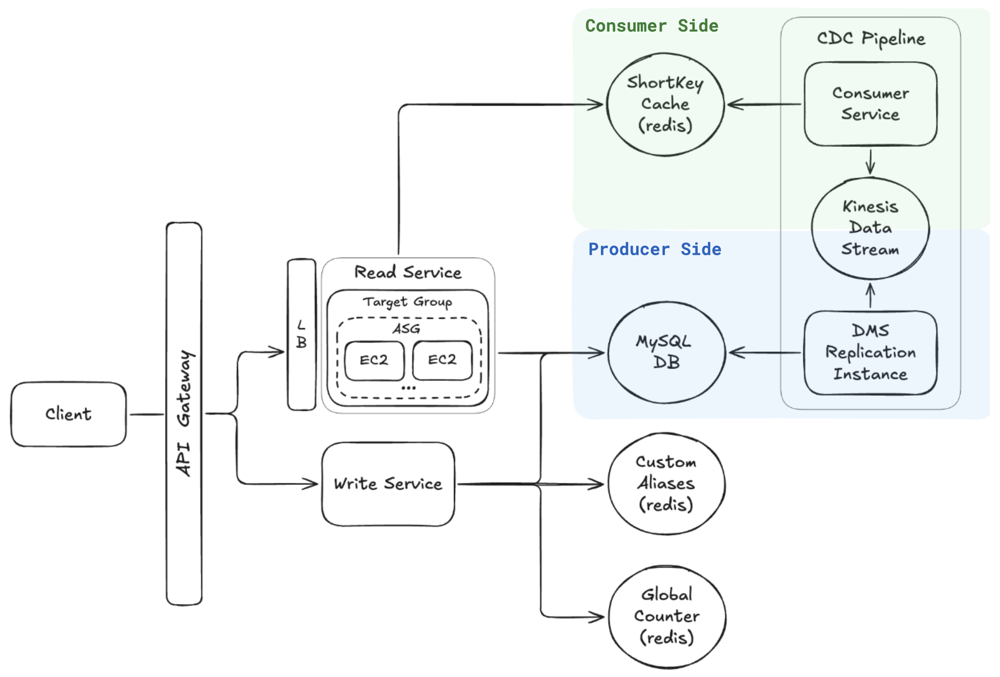

# 📺 Url Shortener – Section 8

In this section, we implement **Change Data Capture (CDC)** using AWS DMS and Kinesis. This setup allows us to stream new records from our MySQL database directly into a Kinesis Data Stream in real time, enabling event-driven updates for downstream services like caching or analytics.

- **Part 1** walks through configuring the **CDC producer pipeline**: setting up DMS to replicate changes from our RDS MySQL database into a Kinesis stream.

- **Part 2** focuses on building the **CDC consumer pipeline**: we write a Lambda function to consume these Kinesis events, deploy it to AWS, and test the full end-to-end flow.

<div align="center">
    
</div>

## 🎥 Video Walkthroughs

### 🔹 Part 1: Set Up CDC Producer with DMS + Kinesis

**Title:** Url Shortener – Section 8 (Part 1)  
**Link:** [Watch on Udemy](https://www.udemy.com/course/practical-system-design/learn/lecture/55998281#overview)

### 🔹 Part 2: Consume Kinesis Events with Lambda

**Title:** Url Shortener – Section 8 (Part 2)  
**Link:** [Watch on Udemy](https://www.udemy.com/course/practical-system-design/learn/lecture/55998285#overview)

# ⚙️ Instructions and Commands

## ✏️ Part 1 – Set Up CDC Producer with DMS + Kinesis

Create the AWS resources needed for the CDC producer pipeline, including a Kinesis Data Stream, DB Parameter Group, IAM Roles, Replication Instance, Source & Target Endpoints, and a Replication Task.

<br>

## ✏️ Part 2 – Consume Kinesis Events with Lambda

### 1. Trigger a `POST` Request & Verify the Record in Kinesis

Send the following request to create an auto-generated short key that maps to `https://www.youtube.com`:

```bash
curl -i -X POST "<PASTE_YOUR_API_GATEWAY_INVOKE_URL>/url" \
  -H "Content-Type: application/json" \
  -d '{
    "longUrl": "https://www.youtube.com"
  }'
```

-  On **Windows PowerShell**:
  ```bash
  curl.exe -i -X POST "<PASTE_YOUR_API_GATEWAY_INVOKE_URL>/url" `
    -H "Content-Type: application/json" `
    -d '{\"longUrl\": \"https://www.youtube.com\"}'
  ```

> ✔️ _After submitting the request, confirm that the new record appears in your Kinesis Data Stream._

### 2. Set Up the Consumer Lambda Package Structure

Create a directory for the Consumer Lambda package:

```bash
mkdir consumer_lambda_package
```

Create the Lambda handler file:

```bash
touch consumer_lambda_package/lambda_function.py
```

-  On **Windows PowerShell**:
  ```bash
  New-Item consumer_lambda_package/lambda_function.py -ItemType File
  ```

### 3. Package Consumer Lambda and Dependencies for Upload

Navigate into the package directory:

```bash
cd consumer_lambda_package
```

Install `redis` into the local folder (for Lambda packaging):

```bash
pip install redis -t .
```

- Alternatively (on some systems):
  ```bash
  pip3 install redis -t .
  ```

Create a deployment package:

```bash
zip -r lambda_function.zip .
```

-  On **Windows PowerShell**:
  ```bash
  Compress-Archive -Path * -DestinationPath lambda_function.zip
  ```

### 4. Connect to Redis Instance Using CLI

Connect to your Redis instance using the CLI:

```bash
redis-cli -u redis://default:<YOUR_PASSWORD>@<YOUR_HOST>:<YOUR_PORT>
```

-  On **Windows PowerShell**:
  ```bash
  docker run -it --rm redis redis-cli -u redis://default:<YOUR_PASSWORD>@<YOUR_HOST>:<YOUR_PORT>
  ```

### 5. End-to-End Test of the CDC Pipeline

From the Redis CLI, inspect the current state of the `shortKey_cache`:

```bash
keys *
hkeys url_shortener:shortKey_cache
```

Send the following request to create an auto-generated short key that maps to `https://www.chatgpt.com`:

```bash
curl -i -X POST "<PASTE_YOUR_API_GATEWAY_INVOKE_URL>/url" \
  -H "Content-Type: application/json" \
  -d '{
    "longUrl": "https://www.chatgpt.com"
  }'
```

-  On **Windows PowerShell**:
  ```bash
  curl.exe -i -X POST "<PASTE_YOUR_API_GATEWAY_INVOKE_URL>/url" `
    -H "Content-Type: application/json" `
    -d '{\"longUrl\": \"https://www.chatgpt.com\"}'
  ```

Return to the Redis CLI and confirm that the new short key was added with the correct mapping:

```bash
hkeys url_shortener:shortKey_cache
hget url_shortener:shortKey_cache <AUTO_GENERATED_SHORT_KEY_VALUE>
```

> ✅ _If the pipeline is working correctly, the newly created short key should now appear in Redis._

<br>
