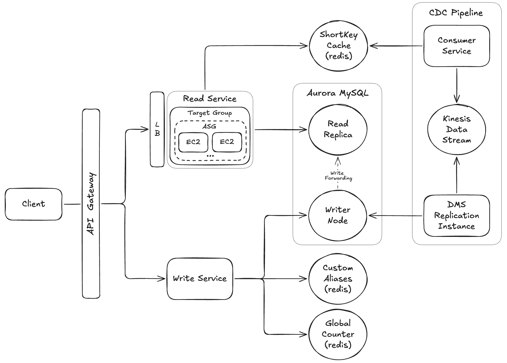

# 📺 Url Shortener – Section 9

In this section, we’ll migrate our URL shortener from a standalone MySQL database to an **Amazon Aurora MySQL** cluster with separate **writer** and **reader** endpoints.

- **Part 1 — Aurora Setup, Data Reset & Service Rebuild**:  
  We reset the legacy MySQL and Redis state, connect to our new Aurora writer and reader instances, recreate the Urls table inside the Aurora cluster, and rebuild the read & write services so they're ready to run against the new database backend.

- **Part 2 — Enable CDC + Validate Full System**:  
  We migrate our CDC pipeline to work with the new Aurora cluster, then run full end-to-end tests for the custom alias write-service flow, auto-generated short-link write-service flow, and the read-service flow.

<div align="center">
    
</div>

## 🎥 Video Walkthrough

### 🔹 Part 1: Aurora Setup, Data Reset & Service Rebuild

**Title:** Url Shortener – Section 9 (Part 1)  
**Link:** [Watch on Udemy](https://www.udemy.com/course/practical-system-design/learn/lecture/55998289#overview)

### 🔹 Part 2: Enable CDC + Validate Full System

**Title:** Url Shortener – Section 9 (Part 2)  
**Link:** [Watch on Udemy](https://www.udemy.com/course/practical-system-design/learn/lecture/55998291#overview)

# ⚙️ Instructions and Commands

## ✏️ Part 1 – Aurora Setup, Data Reset & Service Rebuild

### 1. Connect to MySQL Instance

Launch a MySQL container:

```bash
docker run -it --rm mysql:latest bash
```

Connect to your RDS MySQL database:

```bash
mysql -h <PASTE_YOUR_RDS_ENDPOINT_HERE> -u admin -p
```

> _When prompted, enter the database password:_ `Password100!`

List the available databases:

```bash
SHOW DATABASES;
```

Switch to the `urls_db` database:

```bash
USE urls_db;
```

### 2. Reset Legacy MySQL Database

Inside the MySQL Docker container, list the tables:

```bash
SHOW TABLES;
```

View the existing records in the `Urls` table:

```bash
SELECT * FROM Urls;
```

Delete all records from the table:

```bash
DELETE FROM Urls;
```

Confirm that all records were removed:

```bash
SELECT * FROM Urls;
```

Verify that the `Urls` table still exists:

```bash
SHOW TABLES;
```

### 3. Connect to Redis Instance Using CLI

Connect to your Redis instance using the CLI:

```bash
redis-cli -u redis://default:<YOUR_PASSWORD>@<YOUR_HOST>:<YOUR_PORT>
```

-  On **Windows PowerShell**:
  ```bash
  docker run -it --rm redis redis-cli -u redis://default:<YOUR_PASSWORD>@<YOUR_HOST>:<YOUR_PORT>
  ```

View the current keys in Redis:

```bash
keys *
```

### 4. Reset `custom_aliases` in Redis

From the Redis CLI, view the current members of `custom_aliases`:

```bash
smembers url_shortener:custom_aliases
```

Delete the set:

```bash
del url_shortener:custom_aliases
```

Recreate the set and add a placeholder value:

```bash
sadd url_shortener:custom_aliases __temp__
```

Confirm that the set was successfully reset:

```bash
smembers url_shortener:custom_aliases
```

### 5. Reset `shortKey_cache` in Redis

From the Redis CLI, view the current keys in `shortKey_cache`:

```bash
hkeys url_shortener:shortKey_cache
```

Delete the hash:

```bash
del url_shortener:shortKey_cache
```

Recreate the hash and add a placeholder entry:

```bash
hset url_shortener:shortKey_cache __temp__ ""
```

Confirm that the hash was successfully reset:

```bash
hkeys url_shortener:shortKey_cache
```

### 6. Connect to Aurora Writer & Reader Instances

Open two terminal windows — one for the Writer instance and one for the Reader instance — and connect using the commands below:

- **First Terminal Window (Writer)**  
  Launch a MySQL container:

  ```bash
  docker run -it --rm mysql:latest bash
  ```

  Connect to the Aurora Writer Instance:

  ```bash
  mysql -h <PASTE_YOUR_WRITER_INSTANCE_ENDPOINT> -u admin -p
  ```

  > _When prompted, enter the database password:_ `Password100!`

- **Second Terminal Window (Reader)**  
  Launch a MySQL container:

  ```bash
  docker run -it --rm mysql:latest bash
  ```

  Connect to the Aurora Reader Instance:

  ```bash
  mysql -h <PASTE_YOUR_READER_INSTANCE_ENDPOINT> -u admin -p
  ```

  > _When prompted, enter the database password:_ `Password100!`

Run the following commands in both terminal windows:

- List the available databases:
  ```bash
  SHOW DATABASES;
  ```
- Switch to the `urls_db` database:
  ```bash
  USE urls_db;
  ```
- List the tables to confirm the database is currently empty:
  ```bash
  SHOW TABLES;
  ```

### 7. Create `Urls` Table in the Aurora Cluster

From the **Writer Instance** (first terminal window), create the `Urls` table:

```bash
CREATE TABLE Urls (
    user_id VARCHAR(255) NOT NULL,
    shortKey VARCHAR(255) NOT NULL PRIMARY KEY,
    longUrl TEXT NOT NULL,
    expirationTime DATETIME NULL,
    createdAt DATETIME DEFAULT CURRENT_TIMESTAMP,
    customAlias BOOLEAN DEFAULT FALSE
);
```

From the **Writer Instance** (first terminal window), confirm that the table was created:

```bash
SHOW TABLES;
```

From the **Reader Instance** (second terminal window), verify that the new table is now visible on the read replica:

```bash
SHOW TABLES;
```

### 8. Rebuild and Push Flask App Image

Navigate to the Flask app directory:

```bash
cd read_flask_app
```

Build the updated image for the `linux/amd64` architecture and push it to Docker Hub:

```bash
docker buildx build --platform linux/amd64 -t <PASTE_YOUR_DOCKERHUB_USERNAME>/url-shortener-read --push .
```

<br>

## ✏️ Part 2 – Enable CDC + Validate Full System

### 1. Connect to Aurora Writer Instance:

Launch a MySQL container:

```bash
docker run -it --rm mysql:latest bash
```

Connect to the Aurora Writer Instance:

```bash
mysql -h <PASTE_YOUR_WRITER_INSTANCE_ENDPOINT> -u admin -p
```

> _When prompted, enter the database password:_ `Password100!`

Switch to the `urls_db` database:

```bash
USE urls_db;
```

### 2. Update Binlog Retention on the Aurora Writer Instance

From the Aurora Writer Instance, view the current configuration:

```bash
CALL mysql.rds_show_configuration;
```

Set the binlog retention period to `24 hours`:

```bash
CALL mysql.rds_set_configuration('binlog retention hours', 24);
```

Confirm that the configuration was updated successfully:

```bash
CALL mysql.rds_show_configuration;
```

### 3. Connect to Aurora Reader Instance:

Launch a MySQL container:

```bash
docker run -it --rm mysql:latest bash
```

Connect to the Aurora Reader Instance:

```bash
mysql -h <PASTE_YOUR_READER_INSTANCE_ENDPOINT> -u admin -p
```

> _When prompted, enter the database password:_ `Password100!`

Switch to the `urls_db` database:

```bash
USE urls_db;
```

### 4. Connect to Redis Instance Using CLI

Connect to your Redis instance using the CLI:

```bash
redis-cli -u redis://default:<YOUR_PASSWORD>@<YOUR_HOST>:<YOUR_PORT>
```

-  On **Windows PowerShell**:
  ```bash
  docker run -it --rm redis redis-cli -u redis://default:<YOUR_PASSWORD>@<YOUR_HOST>:<YOUR_PORT>
  ```

### 5. Review the Current Database & Redis State

From the **Aurora Reader Instance**, view the current records in the `Urls` table:

```bash
SELECT * FROM Urls;
```

From the **Redis CLI**, inspect the current state of the existing data structures:

```bash
smembers url_shortener:custom_aliases
hkeys url_shortener:shortKey_cache
get url_shortener:counter
```

### 6. Test Write Service Custom Alias Flow

Send the following request to create a custom alias `xyz321` that maps to `https://www.wikipedia.com`:

```bash
curl -i -X POST "<PASTE_YOUR_API_GATEWAY_INVOKE_URL>/url" \
  -H "Content-Type: application/json" \
  -d '{
    "longUrl": "https://www.wikipedia.com",
    "shortKey": "xyz321"
  }'
```

-  On **Windows PowerShell**:
  ```bash
  curl.exe -i -X POST "<PASTE_YOUR_API_GATEWAY_INVOKE_URL>/url" `
    -H "Content-Type: application/json" `
    -d '{\"longUrl\": \"https://www.wikipedia.com\", \"shortKey\": \"xyz321\"}'
  ```

From the **Aurora Reader Instance**, verify that the new record was persisted:

```bash
SELECT * FROM Urls;
```

From the **Redis CLI**, confirm that the structures were updated correctly:

```bash
smembers url_shortener:custom_aliases

hkeys url_shortener:shortKey_cache
hget url_shortener:shortKey_cache xyz321

get url_shortener:counter
```

### 7. Test Write Service Auto-Generation Flow

Send the following request to create an auto-generated short key that maps to `https://www.facebook.com`:

```bash
curl -i -X POST "<PASTE_YOUR_API_GATEWAY_INVOKE_URL>/url" \
  -H "Content-Type: application/json" \
  -d '{
    "longUrl": "https://www.facebook.com"
  }'
```

-  On **Windows PowerShell**:
  ```bash
  curl.exe -i -X POST "<PASTE_YOUR_API_GATEWAY_INVOKE_URL>/url" `
    -H "Content-Type: application/json" `
    -d '{\"longUrl\": \"https://www.facebook.com\"}'
  ```

From the **Aurora Reader Instance**, verify that the new record was persisted:

```bash
SELECT * FROM Urls;
```

From the **Redis CLI**, confirm that the structures were updated correctly:

```bash
smembers url_shortener:custom_aliases

hkeys url_shortener:shortKey_cache
hget url_shortener:shortKey_cache <AUTO_GENERATED_SHORT_KEY_VALUE>

get url_shortener:counter
```

### 8. Test Read Service

Send a request to retrieve the long URL for the custom alias `xyz321`:

```bash
curl -i -X GET "<PASTE_YOUR_API_GATEWAY_INVOKE_URL>/url/xyz321"
```

-  On **Windows PowerShell**:
  ```bash
  curl.exe -i -X GET "<PASTE_YOUR_API_GATEWAY_INVOKE_URL>/url/xyz321"
  ```

Send a request to retrieve the long URL for the auto-generated short key:

```bash
curl -i -X GET "<PASTE_YOUR_API_GATEWAY_INVOKE_URL>/url/<AUTO_GENERATED_SHORT_KEY_VALUE>"
```

-  On **Windows PowerShell**:
  ```bash
  curl.exe -i -X GET "<PASTE_YOUR_API_GATEWAY_INVOKE_URL>/url/<AUTO_GENERATED_SHORT_KEY_VALUE>"
  ```

Additionally, open the URLs in your browser to confirm that each short key redirects to the expected destination:

```bash
<PASTE_YOUR_API_GATEWAY_INVOKE_URL>/url/xyz321
```

```bash
<PASTE_YOUR_API_GATEWAY_INVOKE_URL>/url/<AUTO_GENERATED_SHORT_KEY_VALUE>
```

<br>
