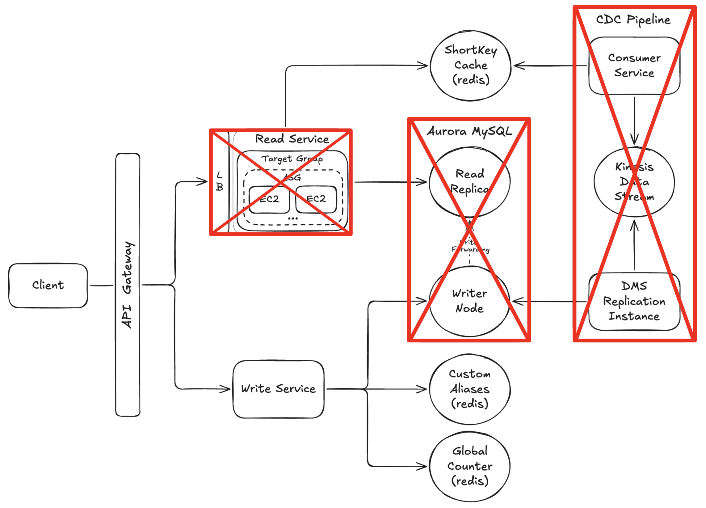

# 📺 Url Shortener – Section 10

In this section, we’ll wrap up the course by reviewing the **AWS Billing Dashboard** to assess the cost impact of the infrastructure we've deployed.
From there, we’ll walk through safely deleting the most expensive resources — starting with Aurora, then decommissioning the EC2 Read infrastructure, and finally tearing down the CDC pipeline.

    

## 🎥 Video Walkthrough

**Title:** Url Shortener – Section 10  
**Link:** [Watch on Udemy](https://www.udemy.com)

# ⚙️ Instructions and Commands

Review the AWS Billing Dashboard, then tear down the most expensive infrastructure components, including the Aurora database cluster, the EC2-based read-service infrastructure, and the CDC pipeline.

 
